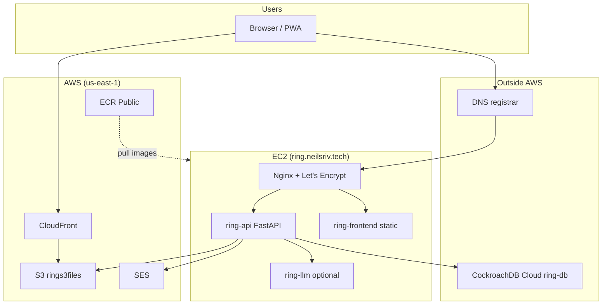

# Infrastructure

How Ring is hosted and which external services it uses. This is a side project
running on a single VM with a few managed cloud services — not a multi-AZ or
Kubernetes setup.

For local development topology, see the Architecture table in
[AGENTS.md](../AGENTS.md). For setup commands, see [README.md](../README.md).

---

## Production topology

Prod is **Docker Compose on one EC2 instance**. Nginx terminates TLS and
reverse-proxies to the API; the React app is served as static files from the
same host.



| Layer | What runs | Where |
|-------|-----------|-------|
| Compute | `ring-api`, `ring-frontend`, Nginx, optional `ring-llm` | EC2 `t2.micro`, Compose (`compose.prod.yml`) |
| Database | CockroachDB | **CockroachDB Cloud** — cluster `ring-db` (GCP `us-east1`). Staging: `ring-db-staging`. |
| Object storage | User-uploaded response images/videos | S3 bucket `rings3files` (`us-east-1`) |
| CDN | Public URLs for uploaded media | CloudFront `du32exnxihxuf.cloudfront.net` → S3 origin |
| Email | Invites, auth, letter notifications | SES (`us-east-1`), domain `neilsriv.tech`, sender `ring@neilsriv.tech` |
| Container images | Prod Docker images | ECR Public `public.ecr.aws/z2k1e8p1/` |
| DNS / TLS | `ring.neilsriv.tech` | DNS at registrar (not Route 53). TLS via Let's Encrypt + certbot on the EC2 host. |

---

## Local vs production

| Concern | Local dev | Production |
|---------|-----------|------------|
| Database | CockroachDB in Docker (`compose.dev.yml`) | CockroachDB Cloud (`COCKROACH_DATABASE_URI` in `.env` on server) |
| API URL | `https://localhost/api/v1/` | `https://ring.neilsriv.tech/api/v1/` |
| Frontend | Vite dev server `:5173` | Static build behind Nginx on EC2 |
| S3 / CloudFront | Same AWS resources (boto3 uses instance/profile creds locally if configured) | EC2 IAM role |
| LLM | Optional Compose service (`llm/`) | Optional `ring-llm` container from ECR |
| TLS | Self-signed local certs (`ring setup local-ssl`) | Let's Encrypt (`compose.prod.yml` certbot profile) |

---

## AWS services (code touchpoints)

### S3 — response media uploads

- **Bucket:** `rings3files` (config: `BUCKET_NAME` in [ring/fastapp/config.py](../ring/fastapp/config.py))
- **Upload:** [ring/letters/crud/response.py](../ring/letters/crud/response.py) via boto3
- **Client factory:** [ring/fastapp/dependencies.py](../ring/fastapp/dependencies.py) (`get_s3_client_dependencies`)
- **Key layout:** `{group_api_id}/{letter_api_id}/{response_api_id}/{sha1_hash}`

### CloudFront — serving uploads

- **Distribution:** `du32exnxihxuf.cloudfront.net`
- **URL construction:** [ring/s3/models/s3_model.py](../ring/s3/models/s3_model.py) (`qualified_s3_url` property)
- Browsers load media from CloudFront; the API writes to S3 directly.

### SES — transactional email

- **Region:** `us-east-1`
- **Module:** [ring/email_util.py](../ring/email_util.py)
- **Default sender:** `ring@neilsriv.tech`
- **Callers:** invite flows, auth emails, task-driven letter/reminder emails under `ring/tasks/crud/`

### ECR Public — container registry

- **Registry:** `public.ecr.aws/z2k1e8p1/`
- **Images pushed by deploy:** `ring-api`, `ring-frontend`, `ring-llm` ([dev_util/docker.py](../dev_util/docker.py))
- **Also in registry (legacy / unused in current deploy):** `ring-worker`, `ring-beat`, `ring-test-runner`, `ring-next`
- **CI tests** use `ghcr.io`, not ECR.

---

## Database

Prod and staging use **CockroachDB Cloud**, not AWS RDS. The old RDS Postgres
host in `dev_util/database.py` was removed — do not add it back.

- **Prod cluster:** `ring-db`
- **Staging cluster:** `ring-db-staging`
- **Migrations:** Alembic (`ring db upgrade`)
- **Vector search:** `hybrid_search_document` table with CockroachDB vector index (768-dim embeddings from the LLM service)

Local dev and tests run CockroachDB in Docker. Connection string:
`COCKROACH_DATABASE_URI` in `.env`.

---

## Request flows

### Normal API traffic

```
Browser → ring.neilsriv.tech (Nginx) → ring-api:8001 → CockroachDB Cloud
```

### Image upload

```
Browser → POST multipart → API → S3 (rings3files)
Browser → GET → CloudFront URL (from API response / qualified_s3_url)
```

### Email

```
API or scheduled task → ring/email_util.send_email → SES (us-east-1)
```

### Search / embeddings

```
API → CockroachDB vector/keyword search
Embedding generation → ring-llm microservice (not AWS Bedrock)
```

---

## Deployment

Build and push from a dev machine:

```bash
ring deploy prod
# or manually:
# VITE_API_URL=https://ring.neilsriv.tech ring compose any --profile prod build
# ring docker tp   # tag + push to ECR Public
```

On the EC2 host:

```bash
cd ring
git pull
./dev_util/prod.sh          # pull images from ECR, retag as prod-*
ring db upgrade
ring compose any --profile prod up -d
ring compose any --profile prod restart nginx   # if needed
```

Compose files: `compose.core.yml` + `compose.prod.yml` (+ `llm/compose.prod.llm.yml` if LLM is enabled).

---

## What we do *not* use

Helpful for agents so they do not assume these exist:

| Service | Notes |
|---------|-------|
| ECS / EKS | Compose on EC2 only |
| RDS | Decommissioned; migrated to CockroachDB Cloud |
| Route 53 | DNS at registrar |
| ACM | TLS via Let's Encrypt on the server |
| ElastiCache / Redis | No managed Redis; background work uses in-process APScheduler |
| Lambda | None |
| Bedrock | Embeddings via self-hosted `ring-llm` |

---

## Related files

| File | Purpose |
|------|---------|
| [compose.prod.yml](../compose.prod.yml) | Prod Compose overrides (images, certbot, Cockroach cert mount) |
| [prod.nginx.conf](../prod.nginx.conf) | Prod Nginx config (`ring.neilsriv.tech`) |
| [dev_util/prod.sh](../dev_util/prod.sh) | Pull ECR images on the server |
| [dev_util/docker.py](../dev_util/docker.py) | Tag/push to ECR Public |
| [.cursor/cloud-start.sh](../.cursor/cloud-start.sh) | Cursor Cloud Agent VM bootstrap (local Cockroach, not prod) |
