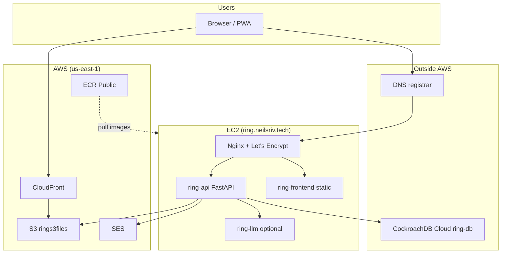

# Infrastructure

How Ring is hosted and which external services it uses. This is a side project
running on a single VM with a few managed cloud services — not a multi-AZ or
Kubernetes setup.

For local development topology, see the Architecture table in
[AGENTS.md](../AGENTS.md). For setup commands, see [README.md](../README.md).

---

## Production topology

Prod is **Docker Compose on one EC2 instance**. Nginx terminates TLS and
reverse-proxies to the API; the React app is served as static files from the
same host.



| Layer | What runs | Where |
|-------|-----------|-------|
| Compute | `ring-api`, `ring-frontend`, Nginx, optional `ring-llm` | EC2 `t2.micro`, Compose (`compose.prod.yml`) |
| Database | CockroachDB | **CockroachDB Cloud** — cluster `ring-db` (GCP `us-east1`). Staging: `ring-db-staging`. |
| Object storage | User-uploaded response images/videos | S3 bucket `rings3files` (`us-east-1`) |
| CDN | Public URLs for uploaded media | CloudFront `du32exnxihxuf.cloudfront.net` → S3 origin |
| Email | Invites, auth, letter notifications | SES (`us-east-1`), domain `neilsriv.tech`, sender `ring@neilsriv.tech` |
| Container images | Prod Docker images | ECR Public `public.ecr.aws/z2k1e8p1/` |
| DNS / TLS | `ring.neilsriv.tech` | DNS at registrar (not Route 53). TLS via Let's Encrypt + certbot on the EC2 host. |

---

## Local vs production

| Concern | Local dev | Production |
|---------|-----------|------------|
| Database | CockroachDB in Docker (`compose.dev.yml`) | CockroachDB Cloud (`COCKROACH_DATABASE_URI` in `.env` on server) |
| API URL | `https://localhost/api/v1/` | `https://ring.neilsriv.tech/api/v1/` |
| Frontend | Vite dev server `:5173` | Static build behind Nginx on EC2 |
| S3 / CloudFront | Same AWS resources (boto3 uses instance/profile creds locally if configured) | EC2 IAM role |
| LLM | Optional Compose service (`llm/`) | Optional `ring-llm` container from ECR |
| TLS | Self-signed local certs (`ring setup local-ssl`) | Let's Encrypt (`compose.prod.yml` certbot profile) |

---

## AWS services (code touchpoints)

### S3 — response media uploads

- **Bucket:** `rings3files` (config: `BUCKET_NAME` in [ring/fastapp/config.py](../ring/fastapp/config.py))
- **Upload:** [ring/letters/crud/response.py](../ring/letters/crud/response.py) via boto3
- **Client factory:** [ring/fastapp/dependencies.py](../ring/fastapp/dependencies.py) (`get_s3_client_dependencies`)
- **Key layout:** `{group_api_id}/{letter_api_id}/{response_api_id}/{sha1_hash}`

### CloudFront — serving uploads

- **Distribution:** `du32exnxihxuf.cloudfront.net`
- **URL construction:** [ring/s3/models/s3_model.py](../ring/s3/models/s3_model.py) (`qualified_s3_url` property)
- Browsers load media from CloudFront; the API writes to S3 directly.

### SES — transactional email

- **Region:** `us-east-1`
- **Module:** [ring/email_util.py](../ring/email_util.py)
- **Default sender:** `ring@neilsriv.tech`
- **Callers:** invite flows, auth emails, task-driven letter/reminder emails under `ring/tasks/crud/`

### ECR Public — container registry

- **Registry:** `public.ecr.aws/z2k1e8p1/`
- **Images pushed by CD:** `ring-api` (`:latest` and `:<git-sha>`) via
  [`.github/workflows/publish_api.yml`](../.github/workflows/publish_api.yml)
- **Still in registry (manual / leftover):** `ring-frontend`, `ring-llm`,
  plus unused `ring-worker`, `ring-beat`, `ring-test-runner`, `ring-next`
- **CI tests** use `ghcr.io`, not ECR.

---

## Database

Prod and staging use **CockroachDB Cloud**, not AWS RDS. The old RDS Postgres
host in `dev_util/database.py` was removed — do not add it back.

- **Prod cluster:** `ring-db`
- **Staging cluster:** `ring-db-staging`
- **Migrations:** Alembic (`ring db upgrade`)
- **Vector search:** `hybrid_search_document` table with CockroachDB vector index (768-dim embeddings from the LLM service)

Local dev and tests run CockroachDB in Docker. Connection string:
`COCKROACH_DATABASE_URI` in `.env`.

Cursor Cloud Agents can optionally point the **local** API (and thus the local
Vite frontend via the same-origin proxy) at Cockroach Cloud — see
[ring-cloud-prod-db](../.cursor/skills/ring-cloud-prod-db/SKILL.md) and
`ring cloud prod-db`. That mode disables APScheduler and must never run
migrations against the cloud URI.

---

## Request flows

### Normal API traffic

```
Browser → ring.neilsriv.tech (Nginx) → ring-api:8001 → CockroachDB Cloud
```

### Image upload

```
Browser → POST multipart → API → S3 (rings3files)
Browser → GET → CloudFront URL (from API response / qualified_s3_url)
```

### Email

```
API or scheduled task → ring/email_util.send_email → SES (us-east-1)
```

### Search / embeddings

```
API → CockroachDB vector/keyword search
Embedding generation → ring-llm microservice (not AWS Bedrock)
```

---

## Deployment

Roadmap: [PR #301](https://github.com/neil-sriv/ring/pull/301) — frontend
via Cloudflare Workers Routes, backend via CI-built SHA-tagged images.
Frontend prod traffic already hits the Worker (`/*`); `/api/*` and
`/.well-known/*` still pass through to this nginx. The steps below are
the current backend flow.

### Publish API images (CI)

Pushes to `dev` that touch `ring/**` (or a manual **Actions → Publish
ring-api** run) build `linux/amd64` and push to ECR Public:

- `public.ecr.aws/z2k1e8p1/ring-api:latest`
- `public.ecr.aws/z2k1e8p1/ring-api:<git-sha>`

Requires repo secrets `AWS_ACCESS_KEY_ID` / `AWS_SECRET_ACCESS_KEY` with
push access to that registry. Use a dedicated IAM user for GitHub Actions,
not laptop keys.

Laptop fallback (API only by default):

```bash
ring deploy prod -t "$(git rev-parse HEAD)"
```

### Pull on the EC2 host

The API bind-mounts `./ring` and runs uvicorn `--reload`, so **the
checkout on disk is the running API code**. The host must be on a branch
(detached `HEAD` makes `git pull` fail):

```bash
cd ring
git checkout dev
git pull origin dev
./dev_util/prod.sh                 # pull ring-api:latest → prod-ring-api
# ./dev_util/prod.sh <git-sha>     # pin / rollback to a CI-published SHA
ring db upgrade                    # only if this commit has a migration
ring compose any --profile prod up -d --force-recreate
```

Confirm what is actually running (no auth):

```bash
curl -sS https://ring.neilsriv.tech/api/v1/version
```

`git` is the host checkout, `image_build` is metadata baked into the API
image, and `docker.containers[].image_id` / `image_digest` come from a
host-written snapshot (`.ring-runtime-version.json`, mounted read-only).
The API does not talk to the Docker Engine.

Compose files: `compose.core.yml` + `compose.prod.yml` (+ `llm/compose.prod.llm.yml` if LLM is enabled).

---

## Frontend PR previews — Cloudflare Workers Builds

Cloudflare's 2026 dashboard is **Workers-first**. The create flow is
"Import a repository" (Workers Builds), not the older Pages
"Connect to Git / Build output directory" form. Use Workers Builds.

The React app is built on every PR and served at a `*.workers.dev`
preview URL, pointed at the **production API** over CORS. Production
traffic still serves the static build from nginx on EC2 (see topology
above). Cloudflare is previews-only unless/until we cut prod over.

### How it fits together

```
PR preview:  https://<alias>-ring-frontend.<account>.workers.dev
             →  https://ring.neilsriv.tech/api/v1/  (CORS)
Production:  https://ring.neilsriv.tech
             →  nginx → ring-frontend + ring-api   (unchanged)
```

- The build sets `VITE_API_URL=https://ring.neilsriv.tech`, so the
  preview calls the prod API cross-origin. Auth is a bearer token in
  localStorage (not cookies), so cross-origin works without SameSite
  issues.
- WebSockets (`/api/v1/ws/`, collaborative notebook) connect directly
  to `wss://ring.neilsriv.tech` — do not proxy `/api` through Cloudflare.
- The API allows preview origins via `BACKEND_CORS_ORIGIN_REGEX`
  ([ring/fastapp/config.py](../ring/fastapp/config.py)) in the server
  `.env`. For Workers preview URLs:
  `^https://[a-z0-9-]+\.[a-z0-9-]+\.workers\.dev$`
- [react/wrangler.jsonc](../react/wrangler.jsonc) is what tells
  Workers where the Vite output lives (`assets.directory = ./dist`) and
  that unmatched routes should serve `index.html`
  (`not_found_handling = single-page-application`). Do **not** add a
  `public/_redirects` `/* /index.html 200` rule — Workers copies
  that file into `dist/` and the API rejects it as an infinite loop
  (error 100324) because default HTML handling already strips
  `.html` / `/index`.
- [react/.nvmrc](../react/.nvmrc) pins Node 22.14.0 for the build image.

### Create the project (current dashboard)

Official flow (Workers Builds, updated 2026-07-03):
[Connect a new Worker](https://developers.cloudflare.com/workers/ci-cd/builds/).

1. Cloudflare dashboard → **Compute** (or **Workers & Pages**) →
   **Create** / **Create application**.
2. Next to **Import a repository**, click **Get started** (this is
   *not* the Templates gallery).
3. Connect GitHub if prompted (app name: **Cloudflare Workers and
   Pages**). Grant access to `neil-sriv/ring` (or the whole account).
4. Select the `ring` repository.
5. On the configure screen, set:

| Field you will see | Value |
|--------------------|-------|
| Project name | `ring-frontend` (must match [react/wrangler.jsonc](../react/wrangler.jsonc)) |
| Production branch | `dev` |
| Root directory | `react` |
| Build command | `pnpm run build` |
| Deploy command | leave default (`npx wrangler deploy`) |
| Preview / non-production deploy | leave default (`npx wrangler versions upload`) |

You will **not** see "Build output directory", "Framework preset", or
"Pages". Those belong to the older Pages wizard (see below).

6. Add **build-time** variables under **Settings → Build → Build
   variables and secrets** (available during `pnpm run build`). Do
   **not** use **Settings → Variables and Secrets** — those are
   runtime Worker bindings and Vite never sees them. Without
   `VITE_API_URL` at build time the client falls back to same-origin
   `/api/v1` on `*.workers.dev` and API calls fail even when CORS
   is configured. Preview builds do not inherit production build
   vars; if the dashboard shows two build triggers, set the same
   values on both. The Preview *runtime* environment tab can stay
   empty.

| Name | Value |
|------|-------|
| `VITE_API_URL` | `https://ring.neilsriv.tech` |
| `VITE_MAINTENANCE_MODE` | `false` |
| `PYTHON_VERSION` | `3.13.3` (image default; skips installing the repo-root `.python-version` pin) |

7. Save / deploy. The first production-branch deploy is unused by
   users; the EC2 nginx frontend remains canonical.
8. After create: **Settings → Build → Branch control** → enable
   **Builds for non-production branches**. Without this, PRs will
   not get preview URLs. Docs:
   [Build branches](https://developers.cloudflare.com/workers/ci-cd/builds/build-branches/).

Preview URLs look like
`<alias>-ring-frontend.<account>.workers.dev` and are posted as a
GitHub PR comment
([preview URLs](https://developers.cloudflare.com/workers/versions-and-deployments/preview-urls/),
[GitHub integration](https://developers.cloudflare.com/workers/ci-cd/builds/git-integration/github-integration/)).

### Older Pages wizard (only if you specifically want Pages)

The Pages form still exists but is a side door. On the same Create
screen, look for a **Pages** / **Looking to deploy a static site?**
link, or use
[Create application > Pages > Import from an existing Git repository](https://developers.cloudflare.com/pages/framework-guides/deploy-a-vite3-project/).
That wizard *does* have Framework preset, **Build command**,
**Build output directory**, and **Root directory (advanced) → Path**.
Vite preset: `npm run build` / `dist`. Override the command to
`pnpm run build`, set Path to `react`, and use a
`BACKEND_CORS_ORIGIN_REGEX` of
`^https://[a-z0-9-]+\.<project>\.pages\.dev$`.

Prefer Workers Builds — Pages is still supported but the default
create path no longer surfaces it.

### Caveats

- **Previews hit prod data.** A preview frontend logs into the real
  API and database. Treat preview links as production access.
- **API contract skew.** A PR that changes the OpenAPI surface will
  preview against the deployed prod API, which may not have the new
  endpoints yet. Land backend PRs first (see `ring-split-pr` skill).
- The PWA service worker registers per-origin; each preview URL gets
  its own isolated service worker. Hard-refresh if a preview looks
  stale.

---

## What we do *not* use

Helpful for agents so they do not assume these exist:

| Service | Notes |
|---------|-------|
| ECS / EKS | Compose on EC2 only |
| RDS | Decommissioned; migrated to CockroachDB Cloud |
| Route 53 | DNS at registrar |
| ACM | TLS via Let's Encrypt on the server |
| ElastiCache / Redis | No managed Redis; background work uses in-process APScheduler |
| Lambda | None |
| Bedrock | Embeddings via self-hosted `ring-llm` |

---

## Related files

| File | Purpose |
|------|---------|
| [compose.prod.yml](../compose.prod.yml) | Prod Compose overrides (images, certbot, Cockroach cert mount) |
| [prod.nginx.conf](../prod.nginx.conf) | Prod Nginx config (`ring.neilsriv.tech`) |
| [dev_util/prod.sh](../dev_util/prod.sh) | Pull ECR images on the server |
| [dev_util/docker.py](../dev_util/docker.py) | Tag/push to ECR Public |
| [.cursor/cloud-start.sh](../.cursor/cloud-start.sh) | Cursor Cloud Agent VM bootstrap (local Cockroach, not prod) |
